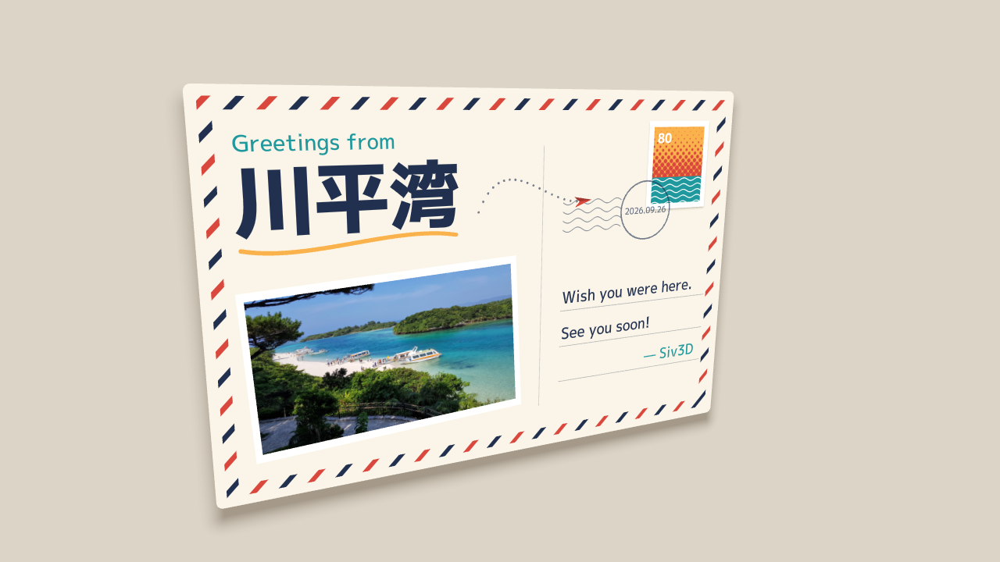

# ScopedQuadWarp2D postcard demo

This airmail postcard applies one projective transform to a photo, shapes,
Stripe / Halftone / Wave patterns, Bézier curves, MSDF text, and shadows. Every
card element uses ordinary 2D drawing calls inside one `ScopedQuadWarp2D`.
Quaternion rotation and perspective projection make the card move as a rigid
sheet of paper; the background and keyboard hint stay in screen coordinates.
See the [renderer guide](../../docs/renderer2d/quad-warp.md) for transform rules
and the shader interface.

## Steps and expected results

1. Paste the complete program below into a separate Siv3D application's
   `Main.cpp`, built with this revision. Keep the repository's platform test
   entry point and its `--test-only` block intact. Use the standard engine assets
   and a working directory containing `example/bay.jpg`, such as `macOS/App`.
2. Move the mouse within the window. The card leans toward the cursor with a
   slow roll. The photo, text, patterns, curves, and shadows should deform
   together, with no diagonal seam in the photo and no missing parts.
3. Hold Space to see the centered, axis-aligned 720 x 480 card without rotation
   or perspective foreshortening. Release it to resume the tilt. Centering the
   mouse alone retains the slow roll and is not the exact flat comparison.
4. Check the red/navy airmail border, the stamp's halftone sunset and wave sea,
   the cancellation lines, and the Japanese title. Patterns should stay attached
   to the paper and MSDF text should remain crisp. The paper plane follows the
   dotted Bézier route, including its tangent direction. The stamp shadow should
   distinguish its white edge from the cream paper.
5. Check that the background and keyboard hint remain stationary while the
   entire card, including its shadow, tilts.

The underline uses 64 subdivisions. Adjust drawing quality explicitly if changing
this demo to use much larger magnifications. The dotted route samples `pointAt()`
and uses `tangentAt()` to orient the plane. Shadow geometry extends outside the
source rectangle; that rectangle does not clip the drawing. Keep all drawn
geometry within the homogeneous-W precondition described in the renderer guide.

## Fixed-pose checks and reference images

To repeat the pose checks, replace the `tilt = tilt.lerp(...)` assignment with
`tilt = Vec2{ x, y };` for each pair below. Set the `RotateZ` argument to `0_deg`
for a stationary card, and release Space while checking the tilted poses.
The focal length is 1000; yaw and pitch are `tilt.x * -28_deg` and
`tilt.y * 22_deg` respectively.

| Tilt | Check |
| --- | --- |
| `(0, 0)` | Front-facing photo, border, text, and stamp |
| `(-0.9, -0.7)` | Perspective toward the upper-left corner |
| `(0.9, 0.6)` | Opposite tilt, including the photo edge and card shadow |
| `(0.4, -0.9)` | Strong vertical tilt, including patterns and text |

The original postcard program was built and visually checked on macOS Debug at
all four poses. The reported results were no diagonal photo seam, crisp MSDF
text, attached patterns and shadows, and no visible homogeneous-W failure at
those poses. These observations cover the original program, before the Space
comparison, keyboard hint, and explicit 64-segment underline were integrated.
They do not establish correctness at arbitrary rotations or magnifications.
The original check did not run the automated suite and did not verify Windows.

The retained 1280 x 720 images are visual references, not pixel-exact regression
fixtures: the postmark date, plane position, and roll can vary. The original
captures have no keyboard hint.

- [Front view, tilt `(0, 0)`](images/quad-warp-postcard-front.png)
- [Tilted view, tilt `(0.9, 0.6)`](images/quad-warp-postcard-tilted.png)



For new retained captures, call
`ScreenCapture::SetScreenshotDirectory(U"quad-warp-captures/")` before the loop
and use the default F12 screenshot shortcut. Output remains under
`quad-warp-captures/` in the application's working directory until removed.
When calling `SaveCurrentFrame()` directly, pass a file name, not an absolute
path: the current implementation prepends the configured screenshot directory.
The unresolved path contract is tracked in [TODO.md](../../TODO.md).

Automated scope, draw-state, and rendering checks live in
[Test_QuadWarp.cpp](../Test_QuadWarp.cpp); matrix checks live in
[Test_Mat3x3.cpp](../Test_Mat3x3.cpp). Follow the host-specific commands in the
[development guide](../../docs/development/README.md) for those tests. The
remaining Windows validation and the candidate projection helper are tracked
in [TODO.md](../../TODO.md).

## Complete Main.cpp

```cpp
# include <Siv3D.hpp>

void Main()
{
	Window::Resize(1280, 720);
	Scene::Resize(1280, 720);
	Scene::SetBackground(ColorF{ 0.86, 0.83, 0.78 });
	const Texture photo{ U"example/bay.jpg" };
	const Font heavy{ FontMethod::MSDF, 48, Typeface::Heavy }, medium{ FontMethod::MSDF, 48, Typeface::Medium };
	const ColorF paper{ 0.98, 0.96, 0.91 }, ink{ 0.13, 0.19, 0.31 }, red{ 0.85, 0.28, 0.24 }, sea{ 0.12, 0.60, 0.62 }, sun{ 0.98, 0.70, 0.30 };
	const RectF card{ 0, 0, 720, 480 }, stamp{ 580, 40, 100, 120 };
	const Bezier3 route{ { 330, 150 }, { 380, 30 }, { 470, 240 }, { 545, 80 } };
	Vec2 tilt{ 0, 0 };

	while (System::Update())
	{
		// Rotate the postcard in 3D, then project its corners onto the screen.
		tilt = tilt.lerp((Cursor::PosF() - Scene::CenterF()) / Scene::CenterF(), 0.08);
		const Quaternion q = KeySpace.pressed() ? Quaternion::Identity()
			: Quaternion::RotateY(tilt.x * -28_deg)
				* Quaternion::RotateX(tilt.y * 22_deg)
				* Quaternion::RotateZ(Math::Sin(Scene::Time()) * 2_deg);
		const auto project = [&](Vec2 p)
		{
			const Vec3 v = q.rotate(Vec3{ p - card.center(), 0 });
			return Scene::CenterF() + v.xy() * (1000 / (1000 + v.z));
		};

		if (const auto h = Mat3x3::TryHomography(card, Quad{ project(card.tl()), project(card.tr()), project(card.br()), project(card.bl()) }))
		{
			const ScopedQuadWarp2D warp{ *h }; // Everything below is ordinary 2D drawing.
			RoundRect{ card, 8 }.drawShadow({ 0, 18 }, 40, 0, ColorF{ 0.25, 0.18, 0.1, 0.35 }).draw(paper);
			card.stretched(-12).drawFrame(14, 0, Pattern::Stripe{ red, paper, 48, 0.3, 45_deg });
			card.stretched(-12).drawFrame(14, 0, Pattern::Stripe{ ink, ColorF{ 0, 0 }, 48, 0.3, 45_deg, { 0.5, 0 } });

			medium(U"Greetings from").draw(24, 44, 44, sea);
			heavy(U"川平湾").draw(88, 40, 62, ink);
			Bezier3{ { 46, 178 }, { 120, 196 }, { 220, 160 }, { 300, 176 } }.draw(LineCap::Round, 5, sun, 64);
			RectF{ Arg::center(215, 320), 346, 206 }.rotated(-3_deg).draw(ColorF{ 1.0 });
			photo.resized(330, 186).rotated(-3_deg).drawAt(215, 320);

			stamp.drawShadow({ 0, 2 }, 6, 0, ColorF{ 0.25, 0.18, 0.1, 0.3 }).draw(ColorF{ 1.0 });
			stamp.stretched(-8).draw(Pattern::Halftone{ red, sun, 7, 0.5, 4, 45_deg, {}, { 0, 50 }, { 0, 120 } });
			RectF{ 588, 116, 84, 36 }.draw(Pattern::Wave{ ColorF{ 1.0 }, sea, 8, 2, 2, 24 });
			heavy(U"80").draw(18, 594, 50);
			Circle{ 580, 160, 40 }.drawFrame(2, ColorF{ ink, 0.6 });
			medium(Date::Today().format(U"yyyy.MM.dd")).drawAt(12, 580, 160, ColorF{ ink, 0.7 });
			RectF{ 450, 136, 90, 48 }.draw(Pattern::Wave{ ColorF{ ink, 0.5 }, ColorF{ 0, 0 }, 12, 2, 3, 30 });

			Line{ 420, 70, 420, 420 }.draw(1, ColorF{ ink, 0.2 });
			for (int32 y : { 290, 340, 390 }) Line{ 450, y, 690, y }.draw(1, ColorF{ ink, 0.3 });
			medium(U"Wish you were here.").draw(22, 452, 256, ink);
			medium(U"See you soon!").draw(22, 452, 306, ink);
			medium(U"— Siv3D").draw(22, 590, 356, sea);

			const double s = Periodic::Sawtooth0_1(4s);
			for (double d = 0; d < s; d += 0.04) Circle{ route.pointAt(d), 1.6 }.draw(ColorF{ ink, 0.6 });
			const Vec2 p = route.pointAt(s), f = route.tangentAt(s) * 13, n{ -f.y * 0.55, f.x * 0.55 };
			Triangle{ p + f, p - f + n, p - f * 0.4 }.draw(red);
			Triangle{ p + f, p - f * 0.4, p - f - n }.draw(red * 0.75);
		}
		medium(U"Move the mouse to tilt / Hold SPACE to see the original rectangle").draw(16, 32, 678, ink);
	}
}
```
